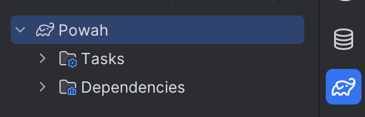
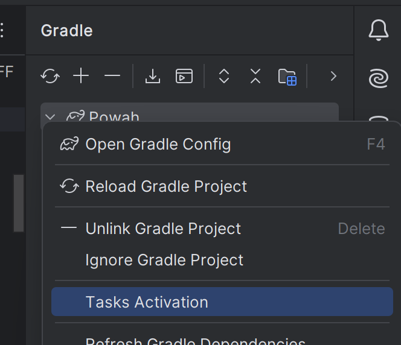
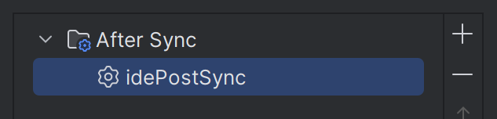

# ModDevGradle(ModDevGradle)


查看 NeoForged 项目列表以获取[最新版本](https://projects.neoforged.net/neoforged/ModDevGradle)。

如果您要更新到插件的新主要版本，请参考[破坏性更改列表](https://github.com/neoforged/ModDevGradle/blob/8d21169e3dec5268d5f6f105bb4ec2f5f55b7f8c/BREAKING_CHANGES.md)。

## 特性(Features)

- 使用最新的 Gradle 最佳实践，并与 Gradle 8.8 兼容
- 创建必要的构件，以便为 [NeoForge](https://neoforged.net/) 编译 Minecraft 模组
- 从 Gradle 或 IntelliJ 运行游戏以进行调试和测试
- 自动创建并使用对开发友好的日志配置以测试模组
- 支持 [Gradle 配置缓存](https://docs.gradle.org/current/userguide/configuration_cache.html)以加速重复的 Gradle 任务运行

## 用于 NeoForge 模组的基本用法(Basic Usage for NeoForge Mods)

在 `gradle.properties` 中：

```properties
# 如果需要，启用 Gradle 配置缓存：
org.gradle.configuration-cache=true
```

在 `settings.gradle` 中：

```groovy
plugins {
    // 此插件允许 Gradle 自动为您下载任意版本的 Java
    id 'org.gradle.toolchains.foojay-resolver-convention' version '0.8.0'
}
```

在 `build.gradle` 中：

```groovy
plugins {
    // 应用插件。您可以在 https://projects.neoforged.net/neoforged/ModDevGradle 找到最新版本
    id 'net.neoforged.moddev' version '1.0.11'
}

neoForge {
    // 我们目前仅支持晚于 21.0.x 的 NeoForge 版本
    // 有关最新更新，请参阅 https://projects.neoforged.net/neoforged/neoforge
    version = "21.0.103-beta"
    
    // 验证 AT 文件并在其具有无效目标时引发错误
    // 此选项默认为 false，但建议开启
    validateAccessTransformers = true

    runs {
        client {
            client()
        }
        data {
            data()
        }
        server {
            server()
        }
    }

    mods {
        testproject {
            sourceSet sourceSets.main
        }
    }
}
```

参见[测试项目](https://github.com/neoforged/ModDevGradle/blob/8d21169e3dec5268d5f6f105bb4ec2f5f55b7f8c/testproject/build.gradle)中的示例代码。

## 原版模式(Vanilla-Mode)

在多加载器项目中，您通常需要一个用于跨加载器代码的子项目。此项目也需要访问 Minecraft 类，但不包含任何加载器特定的扩展。

此插件通过提供“原版模式”来解决此问题，您可以通过指定 [NeoForm 版本](https://projects.neoforged.net/neoforged/neoform)而不是 NeoForge 版本来启用它。NeoForm 包含必要的配置，以生成您可以编译的 Minecraft jar 文件，这些文件不包含其他修改。

在原版模式下，仅支持 `client`、`server` 和 `data` 运行类型。由于插件在此模式下不包含任何模组加载器代码，因此只有基本的资源和数据包才能在游戏中使用。

在 `build.gradle` 中：

像往常一样应用插件，并使用如下配置块：

```groovy
neoForge {
    // 在 https://projects.neoforged.net/neoforged/neoform 上查找版本
    neoFormVersion = "1.21-20240613.152323"

    runs {
        client {
            client()
        }
        server {
            server()
        }
        data {
            data()
        }
    }
}
```

## 禁用反编译和重新编译(Disabling Decompilation and Recompilation)
默认情况下，MDG 将使用 [NeoForm](https://github.com/neoforged/NeoForm) 反编译/重新编译管道来生成 Minecraft 源代码和匹配的编译游戏 jar 文件。这带来了出色的调试体验，但代价是更长的设置时间。

从 MDG 2.0.124 开始，可以使用替代管道，该管道将完全跳过反编译和重新编译。从 MDG 2.0.136 开始，在 CI/CD 管道中，如果 `CI` 环境变量为 `true`，则将默认使用此管道。在许多 CI/CD 系统（例如 GitHub Actions）中，默认情况下为 true。

要手动控制此设置，请替换：
```groovy
neoForge {
    version = "..." // 或 neoFormVersion = "..."
}
```

为：
```groovy
neoForge {
    enable {
        version = "..." // 或 neoFormVersion = "..."
        disableRecompilation = true
    }
}
```

## 常见问题(Common Issues)

### 查看 Minecraft 类时点击“附加源代码”无反应（IntelliJ IDEA）(Clicking "Attach Sources" does nothing when viewing a Minecraft class (IntelliJ IDEA))
有时 IntelliJ 会进入一种状态，即查看反编译的 Minecraft 类时点击“附加源代码”不起作用。

重新加载 Gradle 项目然后再次点击“附加源代码”通常会解决此问题。

### 找不到任务 `idePostSync` （IntelliJ IDEA）(Task `idePostSync` not found (IntelliJ IDEA))
此错误通常在从具有 `idePostSync` 任务的另一个插件切换到 ModDevGradle 时发生。可以通过在 IntelliJ IDEA 中取消注册该任务来修复，如下所示：

<details>
<summary>点击展开</summary>

1. 打开右侧的 Gradle 工具窗口，右键单击 Gradle 项目。



2. 点击 `Tasks Activation`。



3. 选择 `idePostSync` 任务并使用 `-` 按钮删除它。



4. 再次同步 Gradle 项目。

</details>

## 更多配置(More Configuration)

### 运行配置(Runs)

可以在 `neoForge { runs { ... } }` 块中添加任意数量的运行配置。

每个运行必须有一个类型。目前支持的类型有 `client`、`data`、`gameTestServer`、`server`。
可以按如下方式设置运行类型：

```groovy
neoForge {
    runs {
        <run name> {
            // 这是标准语法：
            type = "gameTestServer"
            // Client、data 和 server 运行可以使用简写：
            // client()
            // data()
            // server()
        
            // 更改此运行使用的工作目录。
            // 默认为项目中的 'run' 子目录
            gameDirectory = project.file('runs/client')

            // 添加传递给主方法的参数
            programArguments = ["--arg"]
            programArgument("--arg")

            // 添加传递给 JVM 的参数
            jvmArguments = ["-XX:+AllowEnhancedClassRedefinition"]
            jvmArgument("-XX:+AllowEnhancedClassRedefinition")

            // 添加系统属性
            systemProperties = [
                    "a.b.c": "xyz"
            ]
            systemProperty("a.b.c", "xyz")

            // 设置或添加环境变量
            environment = [
                    "FOO_BAR": "123"
            ]
            environment("FOO_BAR", "123")

            // 可选地设置游戏使用的日志级别
            logLevel = org.slf4j.event.Level.DEBUG

            // 您可以更改此运行在 IDE 中使用的名称
            ideName = "运行游戏测试(Run Game Tests)"
            
            // 您可以禁止为您的 IDE 生成运行配置
            disableIdeRun()
            // ... 或者您可以将 ideName = ""

            // 更改用于此运行的运行时类路径的源集。默认为 "main"
            // Eclipse 不支持每个项目有多个运行时类路径（单元测试除外）。
            sourceSet = sourceSets.main

            // 更改在此运行中加载的本地模组。
            // 默认为此项目中声明的所有模组（在 mods { ... } 内）。
            loadedMods = [mods.<mod name 1>, mods.<mod name 2>]

            // 允许高级用户在每次启动此运行之前运行额外的 Gradle 任务
            // 请注意，使用此功能将显著减慢游戏启动速度
            taskBefore tasks.named("generateSomeCodeTask")
        }
    }
}
```

请查看 [RunModel.java](https://github.com/neoforged/ModDevGradle/blob/8d21169e3dec5268d5f6f105bb4ec2f5f55b7f8c/src/main/java/net/neoforged/moddevgradle/dsl/RunModel.java) 以获取支持的属性列表。
以下是一个示例，设置系统属性以将日志级别更改为调试：

```groovy
neoForge {
    runs {
        configureEach {
            systemProperty 'forge.logging.console.level', 'debug'
        }
    }
}
```

### Jar-in-Jar(Jar-in-Jar)

要将外部 Jar 文件嵌入到您的模组文件中，您可以使用插件添加的 `jarJar` 配置。

#### 外部依赖项(External Dependencies)

当您想要捆绑外部依赖项时，Jar-in-Jar 必须能够在多个模组（可能甚至是不同版本）捆绑该依赖项时选择单个副本。为了支持这种情况，您应该设置一个支持的版本范围以避免模组不兼容。

```groovy
dependencies {
    jarJar(implementation("org.commonmark:commonmark")) {
        version {
            // 您的模组实际兼容的版本范围。
            // 注意，如果另一个模组仅兼容到 1.7.24，您可能会收到一个比您首选的版本*更低*的版本，例如，在运行时您的模组可能会得到 1.7.24。
            strictly '[0.1, 1.0)'
            prefer '0.21.0' // 在您的开发工作区中实际使用的版本
        }
    }
}
```

版本范围使用 [Maven 版本范围格式](https://cwiki.apache.org/confluence/display/MAVENOLD/Dependency+Mediation+and+Conflict+Resolution#DependencyMediationandConflictResolution-DependencyVersionRanges)：

| 范围(Range)         | 含义(Meaning)                                                                       |
|---------------------|-------------------------------------------------------------------------------------|
| (,1.0]              | x \<= 1.0                                                                           |
| 1.0                 | **软**要求 1.0。它允许**任何**版本。                                             |
| [1.0]               | 硬要求 1.0                                                                          |
| [1.2,1.3]           | 1.2 \<= x \<= 1.3                                                                   |
| [1.0,2.0)           | 1.0 \<= x \< 2.0                                                                     |
| [1.5,)              | x \>= 1.5                                                                           |
| (,1.0],[1.2,)       | x \<= 1.0 或 x \>= 1.2。多组之间用逗号分隔                                             |
| (,1.1),(1.1,)       | 如果已知 1.1 与此库结合使用时无法工作，则此范围排除 1.1                              |

#### 本地文件(Local Files)

您还可以将项目中其他任务构建的文件包含在内，例如其他源集的 jar 任务。

当想要为核心模组或插件构建辅助 jar 时，您可以定义一个单独的源集 `plugin`，添加一个 jar 任务来打包它，然后像这样包含该 jar 的输出：

```groovy
sourceSets {
    plugin
}


neoForge {
    // ...
    mods {
        // ...
        // 使插件在开发环境中加载
        'plugin' {
            sourceSet sourceSets.plugin
        }
    }
}

def pluginJar = tasks.register("pluginJar", Jar) {
    from(sourceSets.plugin.output)
    archiveClassifier = "plugin"
    manifest {
        attributes(
                'FMLModType': "LIBRARY",
                "Automatic-Module-Name": project.name + "-plugin"
        )
    }
}

dependencies {
    jarJar files(pluginJar)
}
```

当您像这样包含一个 jar 文件时，我们使用其文件名作为构件 ID，使用其 MD5 哈希作为版本。除非其内容匹配，否则它永远不会与相同名称的嵌入库交换。

#### 子项目(Subprojects)

例如，如果您在子项目中有一个核心模组并希望嵌入其 jar 文件，可以使用以下语法。

```groovy
dependencies {
    jarJar project(":coremod")
}
```

启动游戏时，FML 将使用嵌入的 Jar 文件的组和构件 ID 来确定相同的文件是否已嵌入到其他模组中。对于子项目，组 ID 是根项目名称，而构件 ID 是子项目的名称。除了组和构件 ID 之外，嵌入 Jar 的 Java 模块名称在所有已加载的 Jar 文件中也必须是唯一的。为了在没有显式模块名的情况下减少冲突的可能性，我们在嵌入的子项目的文件名前加上组 ID。

### 外部依赖项：运行(External Dependencies: Runs)
从 Minecraft 1.21.9 开始，外部依赖项不再需要在运行中特殊处理即可加载。

<details>
<summary>显示适用于 1.21.8 及更旧 Minecraft 版本的信息</summary>

外部依赖项只有在它们是模组（具有 `META-INF/neoforge.mods.toml` 文件）时，或者在其 `META-INF/MANIFEST.MF` 文件中设置了 `FMLModType` 条目时，才会在您的运行中被加载。通常，Java 库不符合这些要求，导致在您尝试从模组调用它们时在运行时发生 `ClassNotFoundException`。

要解决此问题，需要将库添加到 `additionalRuntimeClasspath`，如下所示：
```groovy
dependencies {
    // 这仍然是必需的，以便在您的 jar 和编译时添加库。
    jarJar(implementation("org.commonmark:commonmark")) { /* ... */ }
    // 这将库添加到所有运行中。
    additionalRuntimeClasspath "org.commonmark:commonmark:0.21.0"
}
```

*高级*：额外的运行时类路径可以按运行进行配置。例如，要仅将依赖项添加到 `client` 运行，可以将其添加到 `clientAdditionalRuntimeClasspath`。
</details>

### 隔离的源集(Isolated Source Sets)

如果您使用不从 `main` 扩展的源集，并且希望在这些源集中可以使用模组依赖项，您可以使用以下 API：

```
sourceSets {
  anotherSourceSet // 示例
}

neoForge {
  // ...
  addModdingDependenciesTo sourceSets.anotherSourceSet
  
  mods {
    mymod {
      sourceSet sourceSets.main
      // 不要忘记在此处添加额外的源集！
      sourceSet sourceSets.anotherSourceSet
    }
  }
}

dependencies {
  implementation sourceSets.anotherSourceSet.output
}
```

### 更好的 Minecraft 参数名 / Javadoc（Parchment）(Better Minecraft Parameter Names / Javadoc (Parchment))

您可以使用来自 [ParchmentMC](https://parchmentmc.org/docs/getting-started) 的社区提供的 Minecraft 源代码参数名和 Javadoc。

最简单的方法是在您的 gradle.properties 中设置 Parchment 版本：

```properties
neoForge.parchment.minecraftVersion=1.21
neoForge.parchment.mappingsVersion=2024.06.23
```

或者，您可以在 build.gradle 中设置它：

```groovy
neoForge {
    // [...]

    parchment {
        // 从 https://parchmentmc.org/docs/getting-started 获取版本
        // 在 mappingsVersion 中省略 "v" 前缀
        minecraftVersion = "1.20.6"
        mappingsVersion = "2024.05.01"
    }
}
```

### 使用 JUnit 进行单元测试(Unit testing with JUnit)

除了游戏测试，此插件还支持使用 JUnit 对模组进行单元测试。

对于最小设置，请将以下代码添加到您的构建脚本中：

```groovy
// 添加对测试引擎 JUnit 的测试依赖项
dependencies {
    testImplementation 'org.junit.jupiter:junit-jupiter:5.7.1'
    testRuntimeOnly 'org.junit.platform:junit-platform-launcher'
}

// 在 Gradle 中启用 JUnit：
test {
    useJUnitPlatform()
}

neoForge {
    unitTest {
        // 在 moddev 插件中启用 JUnit 支持
        enable()
        // 配置正在测试的模组。
        // 这允许 NeoForge 将 test/ 的类和资源加载为属于该模组。
        testedMod = mods.<mod name > // <mod name> 必须与 mods { } 块中的名称匹配。
        // 如果默认（所有声明的模组）不合适，请配置测试环境中加载的模组。
        // 这必须包含 testedMod，并且也可以包含其他模组。
        // loadedMods = [mods.<mod name >, mods.<mod name 2>]
    }
}
```

您现在可以在 `test/` 文件夹中使用 `@Test` 注解进行单元测试，并引用 Minecraft 类。

#### 加载服务器(Loading a server)

使用 NeoForge 测试框架，您可以在 Minecraft 服务器的上下文中运行单元测试：

```groovy
dependencies {
    testImplementation "net.neoforged:testframework:<neoforge version>"
}
```

通过此依赖项，您可以按如下方式注解您的测试类：

```java
@ExtendWith(EphemeralTestServerProvider.class)
public class TestClass {
    @Test
    public void testMethod(MinecraftServer server) {
        // 使用 server...
    }
}
```

### 集中化仓库声明(Centralizing Repositories Declaration)

此插件支持 Gradle 的[集中化仓库声明](https://docs.gradle.org/current/userguide/declaring_repositories.html#sub:centralized-repository-declaration)，通过在 settings.gradle 中提供一个单独的插件来应用开发模组所需的仓库。可以在 `settings.gradle` 中按如下方式使用：

```groovy
plugins {
    id 'net.neoforged.moddev.repositories' version '<version>'
}

dependencyResolutionManagement {
    repositories {
        mavenCentral()
    }
}
```

请注意，在 build.gradle 中定义任何仓库将完全禁用该项目的集中化管理仓库。您也可以在项目中使用仓库插件来添加仓库，即使依赖管理已被覆盖。

### 访问转换器(Access Transformers)

访问转换器(Access Transformers)是一项高级功能，允许模组放宽 Minecraft 类、字段和方法的访问修饰符。

要使用此功能，您可以在 `src/main/resources/META-INF/accesstransformer.cfg` 处放置一个访问转换器数据文件，并遵守[访问转换器格式](https://docs.neoforged.net/docs/advanced/accesstransformers/)。

**当您使用默认文件位置时，您不需要配置任何东西。**

如果您想使用其他或不同的访问转换器文件，可以通过设置 `accessTransformers` 属性来修改 MDG 读取它们的路径。

:::info
如果您不使用默认路径，您还必须修改您的 neoforge.mods.toml 并配置路径。有关详细信息，请参阅 [NeoForge 文档](https://docs.neoforged.net/docs/advanced/accesstransformers/)。
:::

元素的格式与 `project.files(...)` 期望的格式相同。

```groovy
neoForge {
    // 从父项目中引入访问转换器
    // (选项 1) 添加单个访问转换器，并保留默认值：
    accessTransformers.from "../src/main/resources/META-INF/accesstransformer.cfg"
    // (选项 2) 覆盖整个访问转换器列表，移除默认值：
    accessTransformers = ["../src/main/resources/META-INF/accesstransformer.cfg"]
}
```

此外，您可以使用依赖项块中的正常项目依赖项语法，将额外的访问转换器添加到 `accessTransformers` 配置中。

#### 访问转换器的发布(Publication of Access Transformers)
可选地，访问转换器可以发布到 Maven 仓库，以便其他模组可以使用。要发布访问转换器，请添加如下 `publish` 声明：
```groovy
neoForge {
    accessTransformers {
        publish file("src/main/resources/META-INF/accesstransformer.cfg")
    }
}
```

如果只有一个访问转换器，它将在 `accesstransformer` 分类器下发布。如果有多个，它们将在 `accesstransformer1`、`accesstransformer2` 等分类器下发布。

要使用访问转换器，请将其添加为 `accessTransformers` 依赖项。这将找到所有已发布的访问转换器，无论其文件名如何。例如：
```groovy
dependencies {
    accessTransformers "<group>:<artifact>:<version>"
}
```

### 接口注入(Interface Injection)

接口注入(Interface Injection)是一项高级功能，允许模组在开发时向 Minecraft 类和接口添加额外的接口。此功能要求模组在运行时使用 ASM 或 Mixins 进行相同的扩展。

要使用此功能，请在您的项目中放置一个[接口注入数据文件](https://github.com/neoforged/JavaSourceTransformer?tab=readme-ov-file#interface-injection)，并配置 `interfaceInjectionData` 属性以包含它。由于此功能仅在开发时应用，因此您不需要将此数据文件包含在您的 jar 中。

:::info
此功能仅在开发时应用。您需要在运行时使用 Mixins 或 Coremods 来使其工作。
:::

`build.gradle`
```groovy
neoForge {
    interfaceInjectionData.from "interfaces.json"
}
```

`interfaces.json`
```json
{
  "net/minecraft/world/item/ItemStack": [
    "testproject/FunExtensions"
  ]
}
```

此外，您可以使用依赖项块中的正常项目依赖项语法，将额外的数据文件添加到 `interfaceInjectionData` 配置中。

#### 接口注入数据的发布(Publication of Interface Injection Data)
接口注入数据的发布遵循与访问转换器发布相同的原则。

如果有一个数据文件，它将在 `interfaceinjection` 分类器下发布。如果有多个，它们将在 `interfaceinjection1`、`interfaceinjection2` 等分类器下发布。

```groovy
// 发布一个文件：
neoForge {
    interfaceInjectionData {
        publish file("interfaces.json")
    }
}
// 使用它：
dependencies {
    interfaceInjectionData "<group>:<artifact>:<version>"
}
```

### 使用经过身份验证的 Minecraft 账户(Using Authenticated Minecraft Accounts)
Minecraft 运行通常在开发环境中使用离线用户配置文件。如果您想使用真实的用户配置文件运行游戏，您可以通过将客户端运行的 `devLogin` 属性设置为 `true` 来使用 [DevLogin](https://github.com/covers1624/DevLogin)：

```groovy
neoForge {
    runs {
        // 添加一个经过身份验证的第二个客户端运行
        clientAuth {
            client()
            devLogin = true
        }
    }
}
```

第一次启动经过身份验证的运行时，控制台会要求您访问 https://www.microsoft.com/link 并输入给定的代码。更多信息可在 [DevLogin 自述文件](https://github.com/covers1624/DevLogin)中找到。

## 高级技巧与窍门(Advanced Tips & Tricks)

### 覆盖平台库(Overriding Platform Libraries)

在开发 NeoForge 及其各种平台库期间进行测试时，全局覆盖版本到一个未发布的版本可能很有用。这样做是有效的：

```groovy
configurations.all {
    resolutionStrategy {
        force 'cpw.mods:securejarhandler:2.1.43'
    }
}
```

### 请求额外的 Minecraft 构件(Requesting Additional Minecraft Artifacts)

执行以创建 Minecraft jar 的 NeoForm 过程包含额外的中间结果，这些结果可能在高级构建脚本中有用。

您可以通过使用 `additionalMinecraftArtifacts` 属性请求将这些结果写入特定的输出文件。

哪些结果可用取决于使用的 NeoForm/NeoForge 和 NFRT 版本。（请参见下文以固定 NFRT 版本。）

```groovy
neoForge {
    // 请求 NFRT 将额外结果写入给定位置
    // 这与正常 Minecraft jar 的创建同时进行
    additionalMinecraftArtifacts.put('vanillaDeobfuscated', project.file('vanilla.jar'))
}
```

### NFRT 的全局设置(Global Settings for NFRT)

```groovy
neoFormRuntime {
    // 使用特定的 NFRT 版本
    // Gradle 属性：neoForge.neoFormRuntime.version
    version = "1.2.3"

    // 控制缓存的使用
    // Gradle 属性：neoForge.neoFormRuntime.enableCache
    enableCache = false

    // 启用详细输出
    // Gradle 属性：neoForge.neoFormRuntime.verbose
    verbose = true

    // 为 Minecraft 使用 Eclipse 编译器
    // Gradle 属性：neoForge.neoFormRuntime.useEclipseCompiler
    useEclipseCompiler = true

    // 当 NFRT 无法使用缓存结果时打印更多信息
    // Gradle 属性：neoForge.neoFormRuntime.analyzeCacheMisses
    analyzeCacheMisses = true
    
    // 覆盖 NFRT 用于查找 Minecraft 版本的启动器清单 URL
    // Gradle 属性：neoForge.neoFormRuntime.launcherManifestUrl
    launcherManifestUrl = "https://.../version_manifest_v2.json"
}
```

### 在 IDE 项目同步时运行任务(Running Tasks on IDE Project Synchronization)

您可以添加任务在 IDE 重新加载您的 Gradle 项目时运行。高级用户可能会发现这对于在 IDE 同步项目时运行代码生成任务很有用。

```
neoForge {
    ideSyncTask tasks.named("generateSomeCodeTask")
}
```