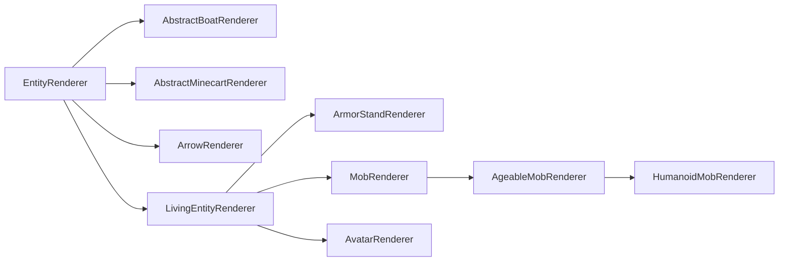

# 实体渲染器(Entity Renderers)

实体渲染器用于定义实体的渲染行为。它们只存在于[逻辑和物理客户端][sides]上。

实体渲染使用所谓的实体渲染状态(Entity Render State)。简单来说，这是一个保存渲染器所需所有值的对象。每次渲染实体时，渲染状态都会更新，然后 `#submit` 方法使用该状态来提交稍后渲染实体所需的[特性(Features)][features]。

## 创建实体渲染器(Creating an Entity Renderer)

最简单的实体渲染器是直接继承 `EntityRenderer` 的渲染器：

``` java
// 超类中的泛型类型应设置为要渲染的实体类型。
// 如果你想为任何实体启用渲染，就像我们在这里做的那样，可以使用 Entity。
// 你还需要使用适合你用例的 EntityRenderState。更多内容见下文。
public class MyEntityRenderer extends EntityRenderer<Entity, EntityRenderState> {
    // 在我们的构造函数中，我们只是传递给超类。
    public MyEntityRenderer(EntityRendererProvider.Context context) {
        super(context);
    }

    // 告诉渲染引擎如何创建新的实体渲染状态。
    @Override
    public EntityRenderState createRenderState() {
        return new EntityRenderState();
    }

    // 通过从传入的实体复制所需的值到传入的状态来更新渲染状态。
    // Entity 和 EntityRenderState 都可以根据传递给超类的泛型类型替换为更具体的类型。
    @Override
    public void extractRenderState(Entity entity, EntityRenderState state, float partialTick) {
        super.extractRenderState(entity, state, partialTick);
        // 在此处提取并存储状态中的任何附加值。
    }
    
    // 实际提交实体的特性进行渲染。
    // 第一个参数与渲染状态的泛型类型匹配。
    // 如果适用，调用 super 将为你处理拴绳和名称标签的提交。
    @Override
    public void submit(EntityRenderState renderState, PoseStack poseStack, SubmitNodeCollector collector, CameraRenderState cameraState) {
        super.submit(renderState, poseStack, collector, cameraState);
        // 在此处进行你自己的提交
    }
}
```

现在我们有了实体渲染器，还需要注册它并将其连接到其所属的实体。这是在 [`EntityRenderersEvent.RegisterRenderers`][events] 中完成的，如下所示：

``` java
@SubscribeEvent // 仅在物理客户端的模组事件总线上
public static void registerEntityRenderers(EntityRenderersEvent.RegisterRenderers event) {
    event.registerEntityRenderer(MY_ENTITY_TYPE.get(), MyEntityRenderer::new);
}
```

## 实体渲染状态(Entity Render States)

如前所述，实体渲染状态用于将渲染所需的值与实际实体的值分离开来。除此之外没有别的，它们真的只是可变的数据存储对象。因此，扩展非常简单：

``` java
public class MyEntityRenderState extends EntityRenderState {
    public ItemStack stackInHand;
}
```

仅此而已。扩展类，添加你的字段，将 `EntityRenderer` 中的泛型类型更改为你的类，然后就可以开始了。现在唯一要做的就是如上所述在 `EntityRenderer#extractRenderState` 中更新 `stackInHand` 字段。

### 渲染状态修改(Render State Modifications)

除了能够定义新的实体渲染状态之外，NeoForge 还引入了一个允许修改现有渲染状态的系统。

为此，可以创建一个 `ContextKey<T>`（其中 `T` 是要更改的数据类型）并将其存储在静态字段中。然后，你可以在 `RegisterRenderStateModifiersEvent` 的事件处理器中使用它，如下所示：

``` java
public static final ContextKey<String> EXAMPLE_CONTEXT = new ContextKey<>(
    // 你的上下文键的ID。用于在内部区分键。
    ResourceLocation.fromNamespaceAndPath("examplemod", "example_context"));

@SubscribeEvent // 仅在物理客户端的模组事件总线上
public static void registerRenderStateModifiers(RegisterRenderStateModifiersEvent event) {
    event.registerEntityModifier(
        // 渲染器的 TypeToken。由于泛型问题，这**必须**被实例化为匿名类（即末尾带有 {}）并具有显式泛型参数。
        new TypeToken<LivingEntityRenderer<LivingEntity, LivingEntityRenderState, ?>>(){},
        // 修改器本身。这是实体和实体渲染状态的 BiConsumer。
        // 确切的泛型类型是从所使用的渲染器类中的泛型推断出来的。
        (entity, state) -> state.setRenderData(EXAMPLE_CONTEXT, "Hello World!")
    );
    
    // 上述方法接受 Class<?> 的重载。
    // 这**应该仅**用于没有任何泛型的渲染器，例如 PlayerRenderer。
    event.registerEntityModifier(
        PlayerRenderer.class,
        (entity, state) -> state.setRenderData(EXAMPLE_CONTEXT, "Hello World!")
    );
}
```

:::tip
通过将 `null` 作为第二个参数传递给 `EntityRenderState#setRenderData`，可以清除该值。例如：

``` java
state.setRenderData(EXAMPLE_CONTEXT, null);
```
:::

然后可以在需要时通过 `EntityRenderState#getRenderData` 检索此数据。辅助方法 `#getRenderDataOrThrow` 和 `#getRenderDataOrDefault` 也可用。

## 继承层次结构(Hierarchy)

与实体本身类似，实体渲染器也有类层次结构，尽管没有那么分层。该层次结构中最重要的类关系如下（红色类为 `abstract`，蓝色类则不是）：



- `EntityRenderer`：抽象基类。许多渲染器，尤其是几乎所有非生物实体的渲染器，都直接继承此类。
- `ArrowRenderer`、`AbstractBoatRenderer`、`AbstractMinecartRenderer`：这些主要是为了方便而存在，并用作更具体渲染器的父类。
- `LivingEntityRenderer`：[生物实体(Living Entities)][livingentity]渲染器的抽象基类。直接子类包括 `ArmorStandRenderer` 和 `PlayerRenderer`。
- `ArmorStandRenderer`：不言自明。
- `AvatarRenderer`：用于渲染 Avatar(化身)，例如玩家。请注意，与大多数其他渲染器不同，此类用于不同上下文的多个实例可能同时存在。
- `MobRenderer`：`Mob` 渲染器的抽象基类。许多渲染器直接继承此类。
- `AgeableMobRenderer`：具有幼年变体的 `Mob` 渲染器的抽象基类。这包括具有幼年变体的怪物，例如疣猪兽。
- `HumanoidMobRenderer`：人形实体渲染器的抽象基类。例如被僵尸和骷髅使用。

与各种实体类一样，使用最适合你用例的类。请注意，这些类中的许多在其泛型中都有相应的类型约束；例如，`LivingEntityRenderer` 对 `LivingEntity` 和 `LivingEntityRenderState` 有类型约束。

## 实体模型、层定义和渲染层(Entity Models, Layer Definitions and Render Layers)

更复杂的实体渲染器，尤其是 `LivingEntityRenderer`，使用层系统，其中每一层都表示为一个 `RenderLayer`。渲染器可以使用多个 `RenderLayer`，并且渲染器可以决定在什么时间提交哪一层。例如，鞘翅使用一个独立的层，与穿着它的 `LivingEntity` 分开处理。类似地，玩家披风也是一个独立的层。

`RenderLayer` 定义了一个 `#submit` 方法，该方法——惊喜！——提交渲染该层所需的[特性(Features)][features]。与大多数其他提交方法一样，你基本上可以在这里提交任何你想要的内容。然而，一个非常常见的用例是在这里提交一个单独的模型，例如用于盔甲或类似的装备。

为此，我们首先需要一个可以提交的模型。我们使用 `Model` 类来实现。`Model` 基本上是供渲染器使用的立方体和相关纹理的列表。它们通常在首次创建实体渲染器的构造函数时静态创建。

:::note
由于我们现在操作的是 `LivingEntityRenderer`，以下代码将假设 `MyEntity extends LivingEntity` 和 `MyEntityRenderState extends LivingEntityRenderState`，以匹配泛型类型约束。
:::

### 创建实体模型类和层定义(Creating an Entity Model Class and a Layer Definition)

让我们从创建实体模型类开始：

``` java
public class MyEntityModel extends EntityModel<MyEntityRenderState> {}
```

请注意，在上面的示例中，我们直接继承 `EntityModel`；根据你的用例，使用其中一个子类，甚至只使用 `Model` 或 `Model` 的非实体相关子类可能更合适。创建新模型时，建议查看与你的用例最接近的现有模型，然后在此基础上进行工作。

接下来，我们创建一个 `LayerDefinition`。`LayerDefinition` 基本上是一个立方体列表，然后我们可以将其烘焙到 `EntityModel` 中。定义 `LayerDefinition` 大致如下所示：

``` java
public class MyEntityModel extends EntityModel<MyEntityRenderState> {
    // 一个静态方法，我们在其中创建我们的层定义。createBodyLayer() 是大多数原版模型使用的名称。
    // 如果你有多个层，你将会有多个这样的静态方法。
    public static LayerDefinition createBodyLayer() {
        // 创建我们的网格(Mesh)。
        MeshDefinition mesh = new MeshDefinition();
        // 网格最初只包含根部分，它是不可见的（大小为0x0x0）。
        PartDefinition root = mesh.getRoot();
        // 我们添加一个头部部件。
        PartDefinition head = root.addOrReplaceChild(
            // 部件的名称。
            "head",
            // 我们要添加的 CubeListBuilder。
            CubeListBuilder.create()
                // 纹理内使用的UV坐标。纹理绑定本身在下面解释。
                // 在此示例中，我们从 U=10, V=20 开始。
                .texOffs(10, 20)
                // 添加我们的立方体。可以多次调用以添加多个立方体。
                // 这是相对于父部件的。对于根部件，它是相对于实体的位置。
                // 请注意，y轴是翻转的，即“向上”是减，“向下”是加。
                .addBox(
                    // 立方体的左上后角，相对于父对象的位置。
                    -5, -5, -5,
                    // 立方体的大小。
                    10, 10, 10
                )
                // 再次调用 texOffs 和 addBox 以添加另一个立方体。
                .texOffs(30, 40)
                .addBox(-1, -1, -1, 1, 1, 1)
                // addBox() 有多种重载，允许进行附加操作，
                // 例如纹理镜像、纹理缩放、指定要渲染的方向，
                // 以及所有立方体的全局缩放，称为 CubeDeformation。
                // 此示例使用后者，请查看各个方法的使用情况以获取更多示例。
                .texOffs(50, 60)
                .addBox(5, 5, 5, 4, 4, 4, CubeDeformation.extend(1.2f)),
            // 应用于 CubeListBuilder 所有元素的初始定位。除了 PartPose#offset，
            // PartPose#offsetAndRotation 也可用。这可以在多个 PartDefinition 中重复使用。
            // 并非所有模型都使用此功能。例如，制作自定义盔甲层将使用相关的
            // 玩家（或其他类人生物）渲染器的 PartPose，以使盔甲“贴合”玩家模型。
            PartPose.offset(0, 8, 0)
        );
        // 我们现在可以向任何 PartDefinition 添加子项，从而创建层次结构。
        PartDefinition part1 = root.addOrReplaceChild(...);
        PartDefinition part2 = head.addOrReplaceChild(...);
        PartDefinition part3 = part1.addOrReplaceChild(...);
        // 最后，我们从 MeshDefinition 创建 LayerDefinition。
        // 两个整数是纹理的预期尺寸；在我们的示例中为64x32。
        return LayerDefinition.create(mesh, 64, 32);
    }
}
```

:::tip
[Blockbench][blockbench] 建模程序是创建实体模型的得力助手。为此，在 Blockbench 中创建模型时选择 Modded Entity 选项。

Blockbench 还有一个选项可以将模型导出为 `LayerDefinition` 创建方法，可以在 `File -> Export -> Export Java Entity` 下找到。
:::

### 注册层定义(Registering a Layer Definition)

一旦我们有了实体层定义，就需要在 `EntityRenderersEvent.RegisterLayerDefinitions` 中注册它。为此，我们需要一个 `ModelLayerLocation`，它本质上充当我们层的标识符（记住，一个实体可以有多个层）。

``` java
// 我们的 ModelLayerLocation。
public static final ModelLayerLocation MY_LAYER = new ModelLayerLocation(
    // 应该是该层所属实体的名称。
    // 如果该层可用于多个实体，则可以是更通用的名称。
    ResourceLocation.fromNamespaceAndPath("examplemod", "example_entity"),
    // 层本身的名称。对于实体的基础模型应为 main，
    // 对于更具体的层（例如“wings”）应使用更具描述性的名称。
    "main"
);

@SubscribeEvent // 仅在物理客户端的模组事件总线上
public static void registerLayerDefinitions(EntityRenderersEvent.RegisterLayerDefinitions event) {
    // 在此处添加我们的层。
    event.add(MY_LAYER, MyEntityModel::createBodyLayer);
}
```

### 创建渲染层和烘焙层定义(Creating a Render Layer and Baking a Layer Definition)

下一步是烘焙层定义，为此我们将首先返回到实体模型类：

``` java
public class MyEntityModel extends EntityModel<MyEntityRenderState> {
    // 将特定的模型部件存储为字段以供下面使用。
    private final ModelPart head;
    
    // 此处传递的 ModelPart 是我们烘焙模型的根。
    // 我们马上就会进行实际的烘焙。
    public MyEntityModel(ModelPart root) {
        // 超类构造函数调用可以可选地指定一个 RenderType。
        super(root);
        // 存储头部部件以供下面使用。
        this.head = root.getChild("head");
    }

    public static LayerDefinition createBodyLayer() {...}

    // 使用此方法根据渲染状态更新模型旋转、可见性等。如果更改了
    // EntityModel 超类的泛型参数，此参数类型也会随之更改。
    @Override
    public void setupAnim(MyEntityRenderState state) {
        // 调用 super 将所有值重置为默认值。
        super.setupAnim(state);
        // 更改模型部件。
        head.visible = state.myBoolean();
        head.xRot = state.myXRotation();
        head.yRot = state.myYRotation();
        head.zRot = state.myZRotation();
    }
}
```

现在我们的模型能够正确接收烘焙后的 `ModelPart`，我们可以创建我们的 `RenderLayer` 子类并像下面这样使用它来烘焙 `LayerDefinition`：

``` java
// 泛型参数需要你到目前为止在其他地方使用的正确类型。
public class MyRenderLayer extends RenderLayer<MyEntityRenderState, MyEntityModel> {
    private final MyEntityModel model;
    
    // 创建渲染层。渲染器参数是必需的，以便传递给超类。
    // 可以根据需要添加其他参数。例如，我们需要 EntityModelSet 来烘焙模型。
    public MyRenderLayer(MyEntityRenderer renderer, EntityModelSet entityModelSet) {
        super(renderer);
        // 烘焙并存储我们的层定义，使用我们注册层定义时的 ModelLayerLocation。
        // 如果适用，你也可以通过这种方式存储多个模型并在下面使用它们。
        this.model = new MyEntityModel(entityModelSet.bakeLayer(MY_LAYER));
    }

    @Override
    public void submit(PoseStack poseStack, SubmitNodeCollector collector, int lightCoords, MyEntityRenderState renderState, float yRot, float xRot) {
        // 在此处提交该层的特性。我们已将实体模型存储在字段中，你可能希望以某种方式使用它。
        collector
            .order(1) // 我们在稍后的迭代中提交特性，以便它在实体上方渲染
            .submitModel(this.model, renderState, poseStack, ...);
    }
}
```

### 向实体渲染器添加渲染层(Adding a Render Layer to an Entity Renderer)

最后，为了将所有内容整合在一起，我们可以像下面这样将层添加到我们的渲染器（如果你还记得，现在它需要是一个生物渲染器）：

``` java
// 插入我们的自定义渲染状态类作为泛型类型。
// 此外，我们需要实现 RenderLayerParent。一些现有的渲染器，例如 LivingEntityRenderer，已经为你实现了这一点。
public class MyEntityRenderer extends LivingEntityRenderer<MyEntity, MyEntityRenderState, MyEntityModel> {
    public MyEntityRenderer(EntityRendererProvider.Context context) {
        // 对于 LivingEntityRenderer，超类构造函数需要提供“基础”模型和阴影半径。
        super(context, new MyEntityModel(context.bakeLayer(MY_LAYER)), 0.5f);
        // 添加层。从上下文中获取 EntityModelSet。出于示例的目的，
        // 我们忽略渲染层提交“基础”模型这一事实，实际上这会是不同的模型。
        this.addLayer(new MyRenderLayer(this, context.getModelSet()));
    }

    @Override
    public MyEntityRenderState createRenderState() {
        return new MyEntityRenderState();
    }

    @Override
    public void extractRenderState(MyEntity entity, MyEntityRenderState state, float partialTick) {
        super.extractRenderState(entity, state, partialTick);
        // 在此处提取你自己的内容，请参阅文章开头。
    }

    @Override
    public void submit(MyEntityRenderState renderState, PoseStack poseStack, SubmitNodeCollector collector, CameraRenderState cameraState) {
        // 调用 super 将自动为你提交该层的特性。
        super.submit(renderState, poseStack, collector, cameraState);
        // 然后，如果适用，在此处进行自定义提交。
    }

    // getTextureLocation 是 LivingEntityRenderer 中的一个抽象方法，我们需要重写它。
    // 纹理路径相对于命名空间，因此它必须指定 assets 目录中命名空间内的确切路径。
    // 在此示例中，纹理应位于 `assets/examplemod/textures/entity/example_entity.png`。
    // 然后，纹理将被提供给模型并使用。
    @Override
    public ResourceLocation getTextureLocation(MyEntityRenderState state) {
        return ResourceLocation.fromNamespaceAndPath("examplemod", "textures/entity/example_entity.png");
    }
}
```

### 整体示例(All At Once)

有点多？由于这个系统相当复杂，以下是所有组件的再次列出（几乎没有冗余内容）：

``` java
public class MyEntity extends LivingEntity {...}
```

``` java
public class MyEntityRenderState extends LivingEntityRenderState {...}
```

``` java
public class MyEntityModel extends EntityModel<MyEntityRenderState> {
    public static final ModelLayerLocation MY_LAYER = new ModelLayerLocation(
            ResourceLocation.fromNamespaceAndPath("examplemod", "example_entity"),
            "main"
    );
    private final ModelPart head;
    
    public MyEntityModel(ModelPart root) {
        super(root);
        this.head = root.getChild("head");
        // ...
    }

    public static LayerDefinition createBodyLayer() {
        MeshDefinition mesh = new MeshDefinition();
        PartDefinition root = mesh.getRoot();
        PartDefinition head = root.addOrReplaceChild(
            "head",
            CubeListBuilder.create().texOffs(10, 20).addBox(-5, -5, -5, 10, 10, 10),
            PartPose.offset(0, 8, 0)
        );
        // ...
        return LayerDefinition.create(mesh, 64, 32);
    }

    @Override
    public void setupAnim(MyEntityRenderState state) {
        super.setupAnim(state);
        // ...
    }
}
```

``` java
public class MyRenderLayer extends RenderLayer<MyEntityRenderState, MyEntityModel> {
    private final MyEntityModel model;
    
    public MyRenderLayer(MyEntityRenderer renderer, EntityModelSet entityModelSet) {
        super(renderer);
        this.model = new MyEntityModel(entityModelSet.bakeLayer(MY_LAYER));
    }

    @Override
    public void submit(PoseStack poseStack, SubmitNodeCollector collector, int lightCoords, MyEntityRenderState renderState, float yRot, float xRot) {
        // ...
    }
}
```

``` java
public class MyEntityRenderer extends LivingEntityRenderer<MyEntity, MyEntityRenderState, MyEntityModel> {
    public MyEntityRenderer(EntityRendererProvider.Context context) {
        super(context, new MyEntityModel(context.bakeLayer(MY_LAYER)), 0.5f);
        this.addLayer(new MyRenderLayer(this, context.getModelSet()));
    }

    @Override
    public MyEntityRenderState createRenderState() {
        return new MyEntityRenderState();
    }

    @Override
    public void extractRenderState(MyEntity entity, MyEntityRenderState state, float partialTick) {
        super.extractRenderState(entity, state, partialTick);
        // ...
    }

    @Override
    public void submit(MyEntityRenderState renderState, PoseStack poseStack, SubmitNodeCollector collector, CameraRenderState cameraState) {
        super.submit(renderState, poseStack, collector, cameraState);
        // ...
    }

    @Override
    public ResourceLocation getTextureLocation(MyEntityRenderState state) {
        return ResourceLocation.fromNamespaceAndPath("examplemod", "textures/entity/example_entity.png");
    }
}
```

``` java
@SubscribeEvent // 仅在物理客户端的模组事件总线上
public static void registerLayerDefinitions(EntityRenderersEvent.RegisterLayerDefinitions event) {
    event.add(MyEntityModel.MY_LAYER, MyEntityModel::createBodyLayer);
}

@SubscribeEvent // 仅在物理客户端的模组事件总线上
public static void registerEntityRenderers(EntityRenderersEvent.RegisterRenderers event) {
    event.registerEntityRenderer(MY_ENTITY_TYPE.get(), MyEntityRenderer::new);
}
```

## 修改现有实体渲染器(Modifying Existing Entity Renderers)

在某些情况下，需要向现有的实体渲染器添加内容，例如，为现有实体渲染额外的效果。大多数情况下，这将影响生物实体，即具有 `LivingEntityRenderer` 的实体。这使我们能够像下面这样向实体添加[渲染层(Render Layer)][renderlayer]：

``` java
@SubscribeEvent // 仅在物理客户端的模组事件总线上
public static void addLayers(EntityRenderersEvent.AddLayers event) {
    // 向每个实体类型添加一个层。
    for (EntityType<?> entityType : event.getEntityTypes()) {
        // 获取我们的渲染器。
        EntityRenderer<?, ?> renderer = event.getRenderer(entityType);
        // 检查我们的渲染层是否被渲染器支持。
        // 如果你想要一个更通用的渲染层，你需要使用通配符泛型。
        if (renderer instanceof MyEntityRenderer myEntityRenderer) {
            // 将层添加到渲染器。像上面一样，构造一个新的 MyRenderLayer。
            // 可以通过事件的 #getEntityModels 获取 EntityModelSet。
            myEntityRenderer.addLayer(new MyRenderLayer(renderer, event.getEntityModels()));
        }
    }
}
```

对于玩家，需要一些特殊处理，因为实际上可以有多个玩家渲染器。这些由事件单独管理。我们可以像下面这样与它们交互：

``` java
@SubscribeEvent // 仅在物理客户端的模组事件总线上
public static void addPlayerLayers(EntityRenderersEvent.AddLayers event) {
    // 遍历所有可能的玩家模型。
    for (PlayerModelType type : event.getSkins()) {
        // 获取相关的 AvatarRenderer。
        AvatarRenderer<AbstractClientPlayer> playerRenderer = event.getPlayerRenderer(type);
        if (playerRenderer != null) {
            // 将层添加到渲染器。这假设渲染层
            // 具有支持玩家和玩家渲染器的正确泛型。
            playerRenderer.addLayer(new MyRenderLayer(playerRenderer, event.getEntityModels()));
        }
    }
}
```

## 动画(Animations)

Minecraft 通过 `AnimationDefinition` 类为实体模型包含了一个动画系统。NeoForge 添加了一个允许在 JSON 文件中定义这些实体动画的系统，类似于 [GeckoLib][geckolib] 等第三方库。

动画定义在位于 `assets/<namespace>/neoforge/animations/entity/<path>.json` 的 JSON 文件中（因此对于[资源位置(Resource Location)][rl] `examplemod:example`，文件将位于 `assets/examplemod/neoforge/animations/entity/example.json`）。动画文件的格式如下：

``` json5
{
    // 动画的持续时间，以秒为单位。
    "length": 1.5,
    // 动画完成时是否应循环（true）或停止（false）。
    // 可选，默认为 false。
    "loop": true,
    // 要动画的部件列表及其动画数据。
    "animations": [
        {
            // 要动画的部件的名称。必须与
            // 你的 LayerDefinition 中定义的部件名称匹配（见上文）。如果有多个匹配项，
            // 将选择深度优先搜索中找到的第一个匹配项。
            "bone": "head",
            // 要更改的值。请参阅下面的可用目标。
            "target": "minecraft:rotation",
            // 部件的关键帧列表。
            "keyframes": [
                {
                    // 关键帧的时间戳，以秒为单位。
                    // 应在 0 到动画长度之间。
                    "timestamp": 0.5,
                    // 关键帧的实际“值”。
                    "target": [22.5, 0, 0],
                    // 使用的插值方法。请参阅下面的可用方法。
                    "interpolation": "minecraft:linear"
                }
            ]
        }
    ]
}
```

:::tip
强烈建议将此系统与 [Blockbench][blockbench] 建模软件结合使用，该软件提供了[动画到 JSON 插件][bbplugin]。
:::

然后，你可以在模型中使用动画，如下所示：

``` java
public class MyEntityModel extends EntityModel<MyEntityRenderState> {
    // 创建并存储对动画持有者的引用。
    public static final AnimationHolder EXAMPLE_ANIMATION =
            Model.getAnimation(ResourceLocation.fromNamespaceAndPath("examplemod", "example"));

    // 一个字段来保存烘焙后的动画
    private final KeyframeAnimation example;

    public MyEntityModel(ModelPart root) {
        // 为模型烘焙动画
        // 传入应用动画的任何 'ModelPart'
        // 它应该覆盖所有引用的骨骼
        this.example = EXAMPLE_ANIMATION.get().bake(root);
    }
    
    // 其他内容在这里。
    
    @Override
    public void setupAnim(MyEntityRenderState state) {
        super.setupAnim(state);
        // 其他内容在这里。
        
        this.example.apply(
            // 从你的 EntityRenderState 获取要使用的动画状态。
            state.myAnimationState,
            // 你的实体年龄，以刻为单位。
            state.ageInTicks
        );
        // apply() 的一个专门版本，设计用于行走动画。
        this.example.applyWalk(state.walkAnimationPos, state.walkAnimationSpeed, 1, 1);
        // 仅应用动画第一帧的 apply() 版本。
        this.example.applyStatic();
    }
}
```

### 关键帧目标(Keyframe Targets)

NeoForge 默认添加以下关键帧目标：

- `minecraft:position`：目标值设置为部件的位置值。
- `minecraft:rotation`：目标值设置为部件的旋转值。
- `minecraft:scale`：目标值设置为部件的缩放值。

可以通过创建新的 `AnimationTarget` 并在 `RegisterJsonAnimationTypesEvent` 中注册来添加自定义值，如下所示：

``` java
@SubscribeEvent // 仅在物理客户端的模组事件总线上
public static void registerJsonAnimationTypes(RegisterJsonAnimationTypesEvent event) {
    event.registerTarget(
        // 新目标的名称，将在 JSON 和其他地方使用。
        ResourceLocation.fromNamespaceAndPath("examplemod", "example"),
        // 要注册的 AnimationTarget。
        new AnimationTarget(...)
    );
}
```

### 关键帧插值(Keyframe Interpolations)

NeoForge 默认添加以下关键帧插值：

- `minecraft:linear`：线性插值。
- `minecraft:catmullrom`：沿 [Catmull-Rom 样条][catmullrom] 插值。

可以通过创建新的 `AnimationChannel.Interpolation`（这是一个函数式接口）并在 `RegisterJsonAnimationTypesEvent` 中注册来添加自定义插值，如下所示：

``` java
@SubscribeEvent // 仅在物理客户端的模组事件总线上
public static void registerJsonAnimationTypes(RegisterJsonAnimationTypesEvent event) {
    event.registerInterpolation(
        // 新插值的名称，将在 JSON 和其他地方使用。
        ResourceLocation.fromNamespaceAndPath("examplemod", "example"),
        // 要注册的 AnimationChannel.Interpolation。
        (vector, keyframeDelta, keyframes, currentKeyframe, nextKeyframe, scale) -> {...}
    );
}
```

[bbplugin]: https://www.blockbench.net/plugins/animation_to_json
[blockbench]: https://www.blockbench.net/
[catmullrom]: https://en.wikipedia.org/wiki/Cubic_Hermite_spline#Catmull–Rom_spline
[events]: ../concepts/events.md
[features]: ../rendering/feature.md
[geckolib]: https://github.com/bernie-g/geckolib
[livingentity]: livingentity.md
[renderlayer]: #creating-a-render-layer-and-baking-a-layer-definition
[rl]: ../misc/resourcelocation.md
[sides]: ../concepts/sides.md